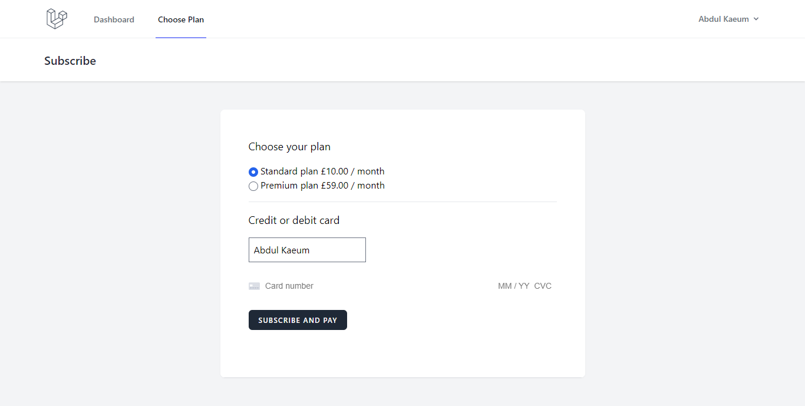
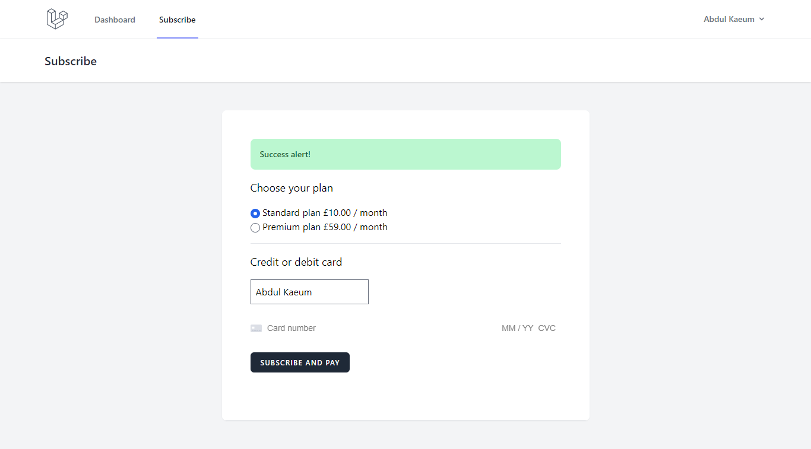
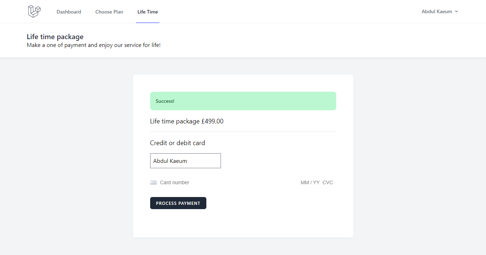
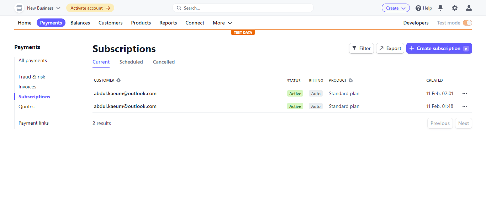
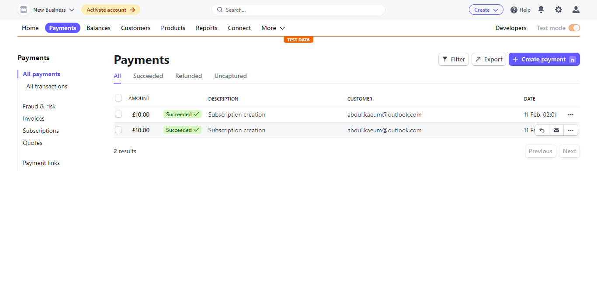
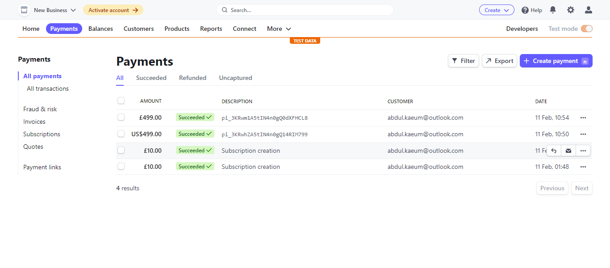
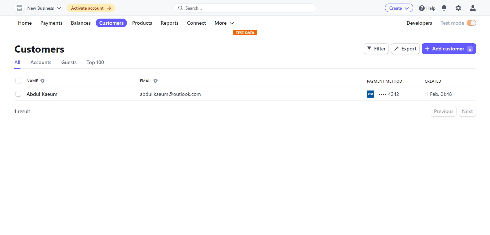

### Simulating online payments via Stripe and Cashier

#### Application features and details
- Simulating a subscription plan
- Simulating a single charge
- Stripe migrations on user model to capture stripe_id. Ideally this information should be recorded in a separate model.
- Subscription plan uses the subscriptions and subscription_item models

#### Screenshots
- Subscription form

- Subscription success

- Life plan purchase success 

- Strpe subscriptions captured

- Strpe subscription payments captured.png

- Strpe single charge payments captured.png

- Stripe customer created

